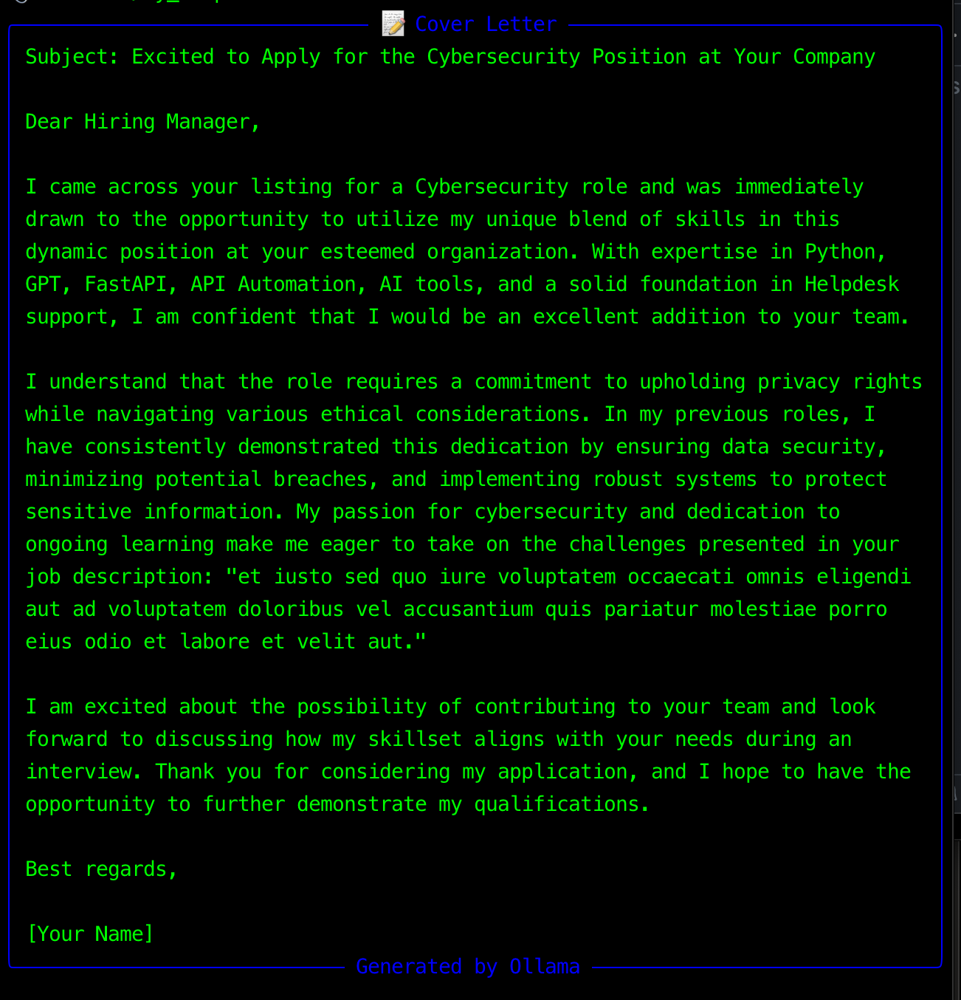
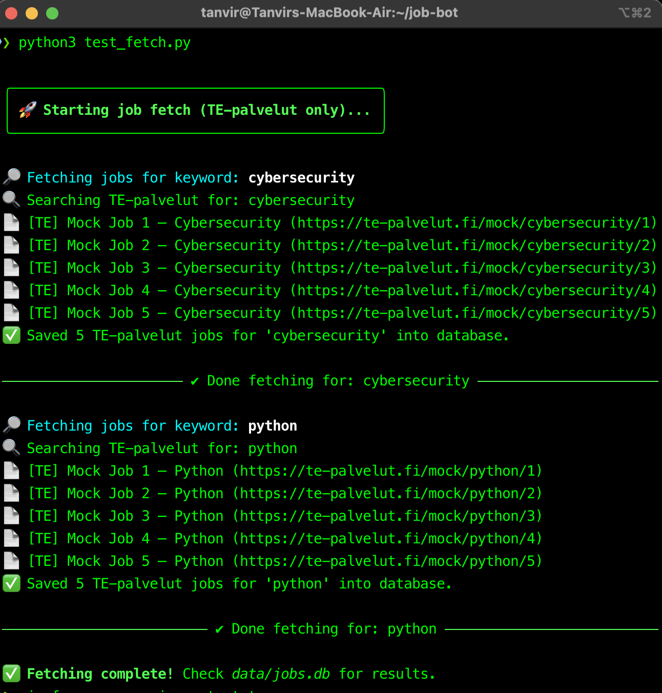
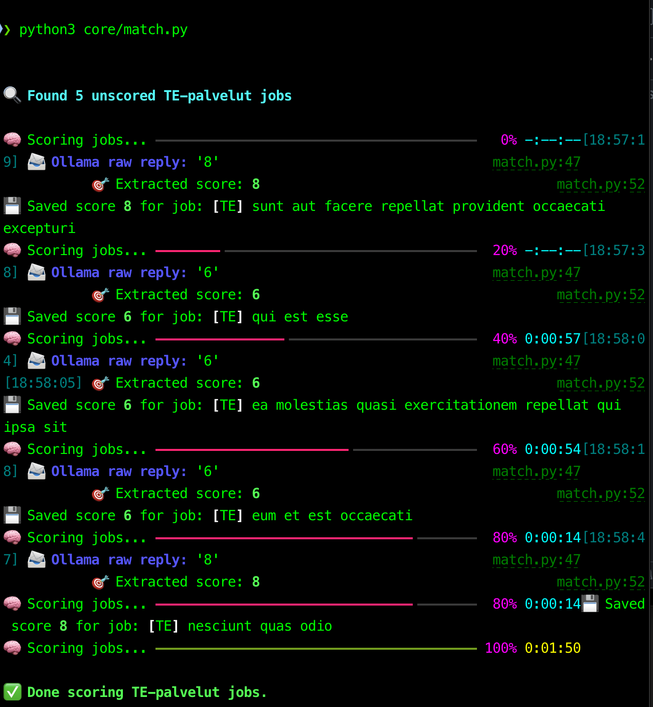
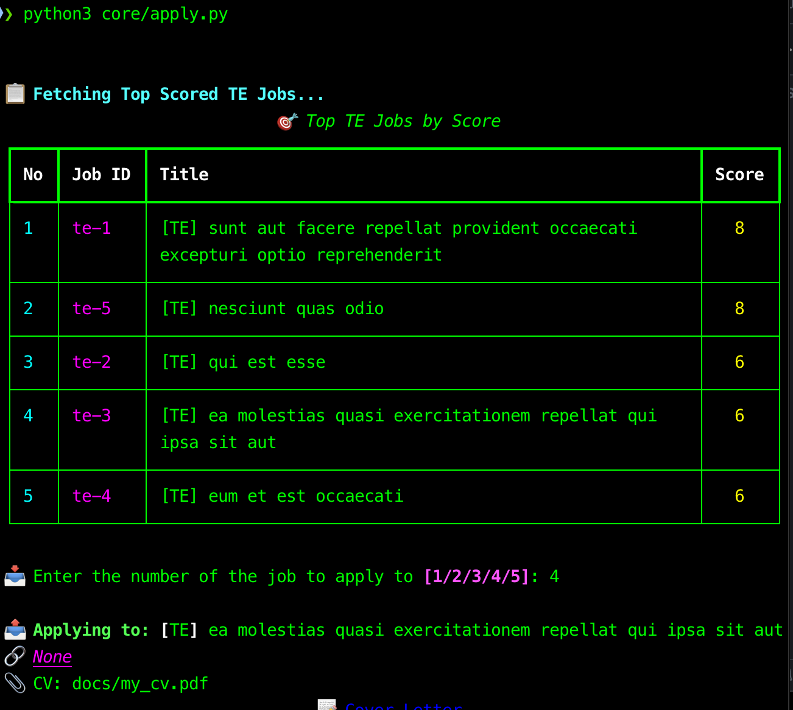
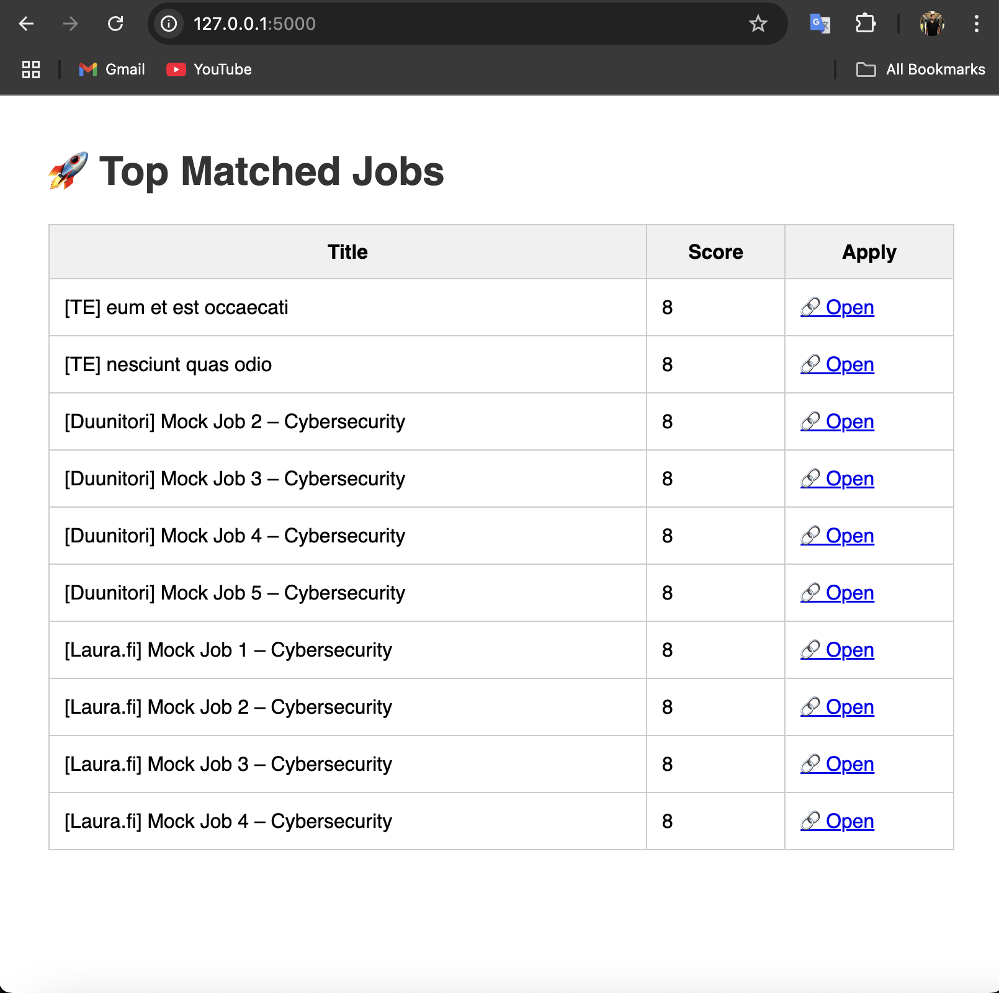

# 🤖 Job-Bot: AI-Powered TE-palvelut Job Matcher

Job-Bot is a smart portfolio project that fetches real jobs from Finland's **TE-palvelut**, matches them against your skills using an **open-source LLM via Ollama**, and helps you apply with a **generated cover letter** — all from the command line or web UI.

---

## 🌟 Features

### ✅ Job Fetching (Real API)

* Pulls job listings for specific keywords from the official [TE-palvelut](https://www.te-palvelut.fi/) source.
* Keywords configurable (`cybersecurity`, `python`, etc.)
* Extensible design for additional connectors (Laura.fi, Duunitori).

### 🧠 Skill Matching with Ollama + Mistral

* Uses [Ollama](https://ollama.com/) to run `mistral` locally.
* Scores how well each job matches your skills (0–10).
* Saves scores in `jobs.db` for ranking and retrieval.

### 📤 AI Cover Letter Generator

* Generates a tailored, professional cover letter for each job using your skills + job description.
* Example:
  

### 🧪 CLI UX Enhancements (Rich)

* Uses `rich` for color-coded logs, score tables, loading spinners, banners.
* Clean, guided experience.
* Example:
  
  
  

### 📊 Web Dashboard (Flask UI)

* Simple dashboard to view saved jobs, scores, and manually apply.
* Run with: `python webapp/main.py`
* Example:
  

### 🚫 Duplicate Prevention

* Logged applications in `logs/applications_sent.log`
* Prevents reapplying to the same job.

### 📁 Folder Structure

```
job-bot/
├── connectors/              # Fetch from TE-palvelut, Duunitori, Laura.fi
│   ├── te_palvelut.py
│   ├── duunitori.py
│   └── laura.py
├── core/                    # Main logic
│   ├── match.py             # Scoring
│   ├── apply.py             # Apply + Cover Letter
│   ├── show_top.py          # CLI Viewer
│   └── normalize.py
├── data/
│   └── jobs.db              # SQLite DB for all job records
├── docs/
│   ├── my_cv.pdf            # Your CV (attached when applying)
│   └── cover_letter.txt     # Last generated letter (optional)
├── logs/
│   └── applications_sent.log
├── utils/
│   └── db.py                # DB helper utils
├── webapp/                  # Flask-based mini dashboard
│   ├── main.py
│   └── templates/
│       └── index.html
├── requirements.txt
├── README.md
└── .env                     # For local API keys (if needed)
```

---

## 🛠️ Installation

### 1. Clone & Setup

```bash
git clone https://github.com/tanviiiiir-r/job-bot.git
cd job-bot
python3 -m venv venv
source venv/bin/activate
pip install -r requirements.txt
```

### 2. Install Ollama + Mistral

```bash
brew install ollama
ollama run mistral
```

---

## 🚀 Usage

### 🔍 Fetch Jobs

```bash
python3 test_fetch.py
```

### 🧠 Match & Score

```bash
python3 core/match.py
```

### 📊 Show Top Matches

```bash
python3 core/show_top.py
```

### 📝 Apply via CLI

```bash
python3 core/apply.py
```

### 🌐 Web Dashboard

```bash
python3 webapp/main.py
```

Visit [http://localhost:5000](http://localhost:5000)

---

## 📌 Future Updates

* [ ] Full integration of Duunitori and Laura.fi job sources
* [ ] AI-based auto-fill of online job forms (browser automation)
* [ ] Export reports to PDF/Markdown
* [ ] Add Telegram/Slack notifications for new matches
* [ ] Job type filters (remote, hybrid, etc.)
* [ ] Support for multiple user profiles
* [ ] Language detection & translation for international jobs

---

## 📸 Screenshots

| CLI Fetch & Score              | Web Dashboard                      |
| ------------------------------ | ---------------------------------- |
|  |  |
|  |   |

---

## 🧠 Author

Built by Md Tanvir Rana, powered by local AI models.

---

## 📄 License

MIT License. Use freely, attribute when you share. ✨
